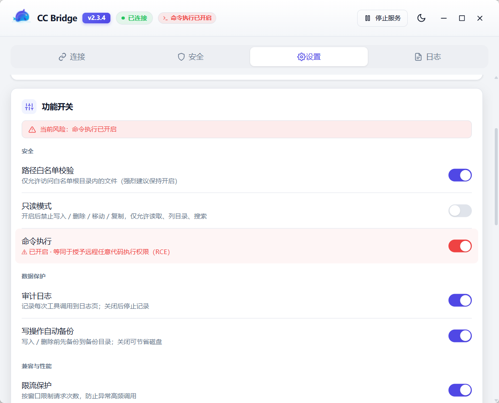
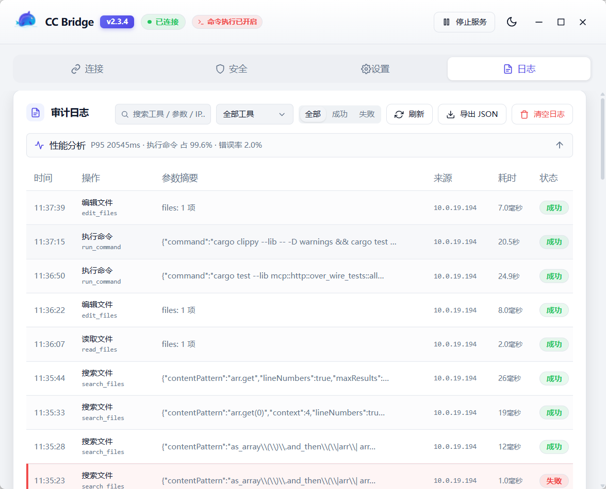

# cc-bridge — 让远程 Claude Code 直接读写你本机文件

[](https://github.com/lzlkyb/cc-bridge/releases)
[](LICENSE)
[](https://github.com/lzlkyb/cc-bridge/stargazers)
[](https://github.com/lzlkyb/cc-bridge/releases)

> 你在本地 Windows 写代码，Claude Code 跑在远程 Linux？别再 scp 来回倒腾文件了——装个 cc-bridge，让远端的 Claude Code 像在本地一样直接读、写、搜你的文件，全程有白名单、审计日志、还能一键还原。安装包只有 **3.4MB**。

### 界面一览

| 连接页 | 安全页 | 设置页 | 日志 / 审计页 |
|---|---|---|---|
|  |  |  |  |

> 截图存放于 `docs/images/`：`connect.png`（连接页：状态 / 一键复制命令）、`security.png`（安全页：白名单 + 开关）、`settings.png`（设置页：IP 变更检测 / 备份浏览器 / 启动项等开关）、`logs.png`（日志页：审计时间线）。建议单张压缩到 500KB 以内。

## 这是什么

**cc-bridge** 是一个运行在本地 Windows 开发机上的 MCP（Model Context Protocol）文件桥接服务，以原生桌面应用形式运行（Tauri 2）。远程 Claude Code 通过 `claude mcp add --transport http` 接入后，可直接操作本地文件系统——不再需要 scp 传文件或 SSHFS 挂载。

## 背景 / 解决的问题

团队在本地 Windows 写代码，Claude Code 部署在远程 Linux 上。原来的痛点：

1. **文件传输效率低**：每次改动都要 scp，大文件慢，容易版本混乱。
2. **SSHFS 不稳定**：网络一断挂载点卡死，终端被阻塞。
3. **缺少智能化操作**：只能终端命令操作文件，没有批量重构、代码分析能力。
4. **操作无法审计**：不知道 Claude 改了哪些文件，误操作后无法追溯恢复。

## 快速开始（约 1 分钟）

1. **下载安装**：到 [Releases](https://github.com/lzlkyb/cc-bridge/releases) 下载 `cc-bridge_x.x.x_x64-setup.exe`（国内用户建议走 Gitee 镜像，下载更快），双击安装并启动。
2. **开放目录**：打开「安全」页 → 点「浏览」把你的工作目录加进白名单（默认拒绝一切访问，安全优先）。
3. **复制连接命令**：切到「连接」页，复制给出的 `claude mcp add ...` 命令。
4. **远端接入**：粘贴到远程 Linux 终端执行，Claude Code 立刻就能读写你本机的文件了。

> 仅建议在同一内网 / VPN 下使用，不要暴露到公网（详见文末「已知限制」）。

## 架构

```
远程 Linux 服务器（Claude Code）
        │  MCP 协议 / Streamable HTTP（同一内网/VPN 直连）
        ▼
本地 Windows 开发机
        │
        └─ cc-bridge.exe ── 单进程 Tauri 2 桌面应用
              │
              ├─ 嵌入式 axum HTTP 服务器 ── MCP JSON-RPC 协议 + 17 个文件工具
              │                             + 安全校验 + 自动备份 + 限流 + 审计
              │
              ├─ SQLite 配置存储 ── 原子更新，无竞态
              │
              └─ React 前端 ── Tauri IPC 通信，管理面板
```

**关键架构决策**：
- **纯 Rust 后端**编译进 Tauri 二进制，不再有 Node.js sidecar（安装包 3.4MB，二进制 14MB）
- **axum 嵌入 Tauri 进程**：对外暴露 HTTP 端口供远程 Claude Code 连接
- **前端走 Tauri IPC**：不走 HTTP，token 只用于远程认证
- **SQLite 替换 config.json**：原子更新，无 read-modify-write 竞态
- **审计日志保持 JSONL 文件**：append-only，人类可读

## 交互流程

### 启动流程

```
用户双击 cc-bridge.exe
        │
        ▼
  tauri::Builder
        │
        ├─ 1. single-instance 检查
        │     └─ 已有实例运行 → 激活已有窗口，本次退出
        │
        ├─ 2. setup() 初始化
        │     ├─ 创建 AppData 目录
        │     ├─ db::init_database()
        │     │    ├─ 创建 SQLite config 表
        │     │    └─ 检测 config.json → 自动迁移到 SQLite
        │     ├─ config::load_config() → 加载 BridgeConfig
        │     ├─ 构建 AppState（DB / Config / Locks / Stats）
        │     │
        │     ├─ spawn axum HTTP 服务器
        │     │    └─ 监听 0.0.0.0:7823，路由 /health + /mcp
        │     │
        │     ├─ 创建主窗口 (1080×820)，加载 React 前端
        │     │
        │     └─ 创建系统托盘
        │          菜单: 打开面板 / 重启服务 / 退出
        │
        ├─ 3. on_window_event
        │     └─ 点关闭 → 隐藏窗口（不退出进程）
        │
        └─ 4. run() → Tauri 事件循环
```

### 两条通信路径

cc-bridge 内部有两条独立的通信路径，共享同一个 `AppState`：

```
┌─────────────────────┐                 ┌──────────────────────────────────┐
│  远程 Linux 服务器    │                 │   本地 Windows                   │
│                     │                 │                                  │
│  Claude Code        │   HTTP / TCP    │   cc-bridge.exe (单进程)          │
│  (MCP 客户端)       │────────────────▶│                                  │
│                     │   内网:7823     │   ┌─ axum HTTP 服务器 ─┐         │
│  通过 MCP 协议       │                 │   │  POST /mcp         │         │
│  调用 17 个文件工具   │                 │   │  Bearer token 认证  │         │
│                     │                 │   │  JSON-RPC dispatch │         │
└─────────────────────┘                 │   │  → 17 个工具处理器  │──┐      │
                                        │   │  → 安全校验         │  │      │
                                        │   │  → 审计日志         │  │      │
                                        │   └────────────────────┘  │      │
                                        │                           │      │
                                        │   ┌─ Tauri WebView ──┐    │      │
                                        │   │  React 前端       │    │      │
                                        │   │  invoke() ───────┼─┐  │      │
                                        │   │  (Tauri IPC)     │ │  │      │
                                        │   └──────────────────┘ │  │      │
                                        │                        ▼  │      │
                                        │   ┌─ Rust 后端 ───────┐   │      │
                                        │   │ #[tauri::command] │   │      │
                                        │   │ 10 个 IPC 命令    │◀──┘      │
                                        │   │                  │          │
                                        │   │ AppState ◀───────┼── 共享    │
                                        │   │ (DB/Config/Stats)│          │
                                        │   └──────────────────┘          │
                                        │                                  │
                                        │   ┌─ 本地文件系统 ─────┐          │
                                        │   │ C:\work\...       │◀─────────┘
                                        │   │ D:\projects\...   │  读/写/删/搜
                                        │   └───────────────────┘
                                        └──────────────────────────────────┘
```

**关键设计**：两条路径共享同一个 `AppState`——远程 Claude Code 的文件操作会实时反映在本地面板的审计日志和统计数据中。

### MCP 工具调用链路

远程 Claude Code 调用文件工具时的完整请求链路：

```
远程 Linux:
  claude mcp add --transport http cc-bridge http://192.168.1.100:7823/mcp \
    --header "Authorization: Bearer abc123..."

Claude Code 对话中触发工具调用:
        │
        ▼
  POST /mcp  ──  initialize (首次连接握手)
        │          返回 capabilities + serverInfo
        ▼
  POST /mcp  ──  notifications/initialized (握手完成)
        │
        ▼
  POST /mcp  ──  tools/list (发现可用工具)
        │          返回 17 个工具的 name + description + inputSchema
        ▼
  POST /mcp  ──  tools/call (实际调用)
        │
        ├─ auth_middleware
        │    └─ 验证 Bearer token（常量时间比较）
        │
        ├─ rate_limiter
        │    └─ 滑动窗口检查（100次/分钟）
        │
        ├─ dispatch_tool()
        │    ├─ resolve_safe_path()      ← canonicalize + 白名单校验
        │    ├─ assert_extension_allowed() ← 扩展名检查
        │    ├─ assert_file_size_ok()     ← 大小限制
        │    ├─ path_lock (写操作)        ← DashMap 并发锁
        │    ├─ backup (写/删操作)        ← 自动备份
        │    └─ 执行实际文件操作
        │
        ├─ audit::write_audit_log()       ← 追加 JSONL
        │
        └─ stats.increment_requests()     ← 更新统计
        │
        ▼
  返回 JSON-RPC 响应 → Claude Code 拿到结果
```

### 用户操作场景

#### 首次使用

```
1. 安装并启动 cc-bridge
2. 主窗口打开，白名单为空（安全默认：拒绝所有操作）
3. 进入"安全"页，在白名单根目录点"浏览…"
   → DirectoryBrowser 弹窗 → 导航选择工作目录 → 添加
4. 回到"连接"页，选择 scope（全局 / 项目级），复制连接命令
5. 粘贴到远程 Linux 终端执行，Claude Code 连上 cc-bridge 即可开始工作
```

#### 日常使用

```
开机 → 双击 cc-bridge → 窗口打开，MCP 服务器自动启动
     → 远程 Claude Code 自动重连
     → 最小化到托盘（点 X = 隐藏，不退出）

两件事并行:
  ┌── 远程 Claude Code 在后台读写文件
  │     每次操作 → 审计日志 + 统计计数
  │
  └── 用户偶尔打开面板查看
        面板每 5s 轮询状态，审计日志每 10s 轮询
```

#### 改端口/地址

```
用户在"设置 → 网络"改 port 7823 → 9000，点"保存并重启服务"
  → save_config 检测 port 变更 → 写入 SQLite（restartRequired: true）
  → 前端自动调用 restart_mcp_server
  → abort 旧 axum → sleep 300ms → spawn 新 axum 监听 9000
  → 连接命令自动更新，远程需重新 claude mcp add
```

#### 系统托盘

```
托盘图标右键:
  打开面板  → 显示/聚焦主窗口
  重启服务  → 杀旧 axum task + 重新启动
  退出     → 真正结束进程（唯一的退出方式）
```

### 数据流向

```
                    ┌────────────────┐
                    │   SQLite DB    │
                    │   (config 表)  │
                    └───────┬────────┘
                            │ load / save
                            ▼
┌──────────┐  IPC   ┌──────────────┐  HTTP   ┌─────────────┐
│ React UI │◀──────▶│  AppState    │◀───────▶│ 远程 Claude │
│ (WebView)│ invoke │  (内存)       │  /mcp   │   Code      │
└──────────┘        │              │         └─────────────┘
                    │ ┌─ config ─┐ │
                    │ │ RwLock   │ │
                    │ ├─ stats ──┤ │
                    │ │ RwLock   │ │
                    │ ├─ locks ──┤ │
                    │ │ DashMap  │ │
                    │ └──────────┘ │
                    └──────┬───────┘
                           │ read / write
                           ▼
                    ┌──────────────┐
                    │ 本地文件系统   │  白名单目录内
                    └──────┬───────┘
                           │
                           ▼
                    ┌──────────────┐
                    │ audit.log    │  JSONL 追加写入
                    │ .bak 备份    │  写/删前自动备份
                    └──────────────┘
```

## 功能清单

### 17 个 MCP 工具（远程 Claude Code 直接调用）

| 工具 | 作用 |
|---|---|
| `list_allowed_roots` | 列出服务端白名单（允许根目录 + 扩展名 + 大小上限），远程首选调用以发现可访问范围，免盲猜 |
| `list_directory` | 列目录，支持递归 + 深度限制 |
| `read_files` | 批量读文件，支持指定行范围（1-based）；返回内容 + 编码 + 换行风格；「读取编码自适应」开关开启时自动识别 GBK/GB18030 统一转 UTF-8（默认关，按 UTF-8 读），可传 `encoding` 强制指定（始终生效） |
| `write_files` | 批量写/新建文件，自动建父目录，覆盖前自动备份 |
| `edit_files` | 精准字符串替换（对标 native Edit），`oldString` 需唯一匹配（或 `replaceAll`），保留原文件编码（GBK 改完仍 GBK），改前备份 |
| `notebook_edit` | 编辑 Jupyter 笔记本（`.ipynb`）：按索引替换/插入/删除单元格，保留其它元数据 |
| `delete_files` | 批量删除文件（不删目录），删前自动备份 |
| `move_files` | 批量移动/重命名，跨盘自动 copy+delete 降级 |
| `copy_files` | 批量复制，目标已存在则先备份 |
| `create_directory` | 创建目录（含缺失父目录），幂等 |
| `remove_directory` | 删除目录，默认仅删空目录，`recursive=true` 递归删除整树（危险，不备份） |
| `search_files` | 按文件名 glob + 内容关键字/正则全文搜索 |
| `batch` | 一次往返批量执行多个工具调用，把 N 次网络往返合并为 1 次（远程链路最大延迟优化）；每个子操作复用同样的白名单 / 只读校验；非事务，出错即停但不回滚已完成写入 |
| `analyze_file` | 编码检测 + 语言识别 + 函数/类数量启发式估算 |
| `run_command` | 执行 Shell 命令（`cmd /C`），前台等待结果或 `background=true` 后台运行；**默认关闭**，需在『安全』页开启「命令执行」开关（等同于授予远程任意代码执行权限），只读模式下无条件禁止；整树 taskkill 终止子进程 |
| `get_command_output` | 增量拉取后台命令的 stdout/stderr（按偏移量），附带是否已结束、退出码 |
| `stop_command` | 强制终止一个后台命令的整个进程树，并从注册表移除 |

### 安全机制

- **路径白名单**（`allowedRoots`）：只能访问明确允许的根目录，`canonicalize()` 防软链接逃逸，祖先遍历防路径穿越。被拒时错误信息会附带当前白名单（`Allowed roots: ...`），远程无需盲猜即可得知可访问范围。
- **扩展名白名单**（`allowedExtensions`）：大小写不敏感匹配，留空表示不限制。
- **Bearer token 认证**：`subtle::ConstantTimeEq` 防时序攻击，32 位随机字母数字。
- **限流**：`DashMap` 滑动窗口，默认 100 次/分钟，超限 429。
- **自动备份**：写/删/覆盖前备份到配置目录，按时间戳命名，超出保留数自动清理。
- **审计日志**：JSONL 格式，记录每次操作的时间/工具/参数/结果/来源 IP/耗时（`durationMs`）；成功与失败调用均记录真实参数；按保留天数（默认 30 天，0=永久）在启动时自动清理。
- **单文件大小上限**：默认 20MB。
- **写锁**：`DashMap<PathBuf, Arc<Mutex<()>>>`，同一文件并发写串行化。

> ⚠️ **传输安全提醒**：默认监听 `0.0.0.0`（方便跨网连接），且 `/mcp` 目前是明文 HTTP，Bearer token 全程以明文传输。
> 同网段内可被嗅探。**请务必只在 VPN 或受信任的内网环境中使用**，不要直接暴露到公网或不受信任的网段。

### HTTP 接口

| 路径 | 方法 | 认证 | 作用 |
|---|---|---|---|
| `/mcp` | POST | Bearer token | MCP JSON-RPC 入口（Streamable HTTP） |
| `/health` | GET | 不需要 | 存活检测 |

### Tauri IPC 命令（前端 → 后端）

| 命令 | 作用 |
|---|---|
| `get_status` | 版本/运行时间/配置/统计/连接命令 |
| `save_config` | 局部更新配置，检测 host/port 变更返回 restartRequired |
| `regenerate_token` | 重新生成 token |
| `get_audit_log` | 最近 N 条审计日志 |
| `browse_directory` | 全盘目录浏览（不受白名单限制，用于目录选择器） |
| `restart_mcp_server` | 杀旧 axum task + 按新配置重启 |
| `get_lan_ips` | 获取局域网 IP 列表 |
| `get_autostart` / `set_autostart` | 读取 / 设置开机自动启动（tauri-plugin-autostart） |

### 管理面板（React 前端）

界面采用 shadcn/ui 设计语言，顶部 Tab 分页布局，共 4 个页面：

- **连接**：状态概览（请求数/错误数/运行时间，运行时间精确到秒且平滑跳秒）+ 高对比启停服务按钮（loading 态 + 失败内联报错）+ `claude mcp add` 命令一键复制 + 全局/项目级 scope 选择 + Token 掩码显示/重新生成
- **安全**：白名单根目录 CRUD + 目录浏览器弹窗；扩展名/文件大小/限流/备份目录/备份保留，全部即时保存（防抖 800ms + 失焦）
- **设置**：网络（host/port，改后一键保存并重启）+ 应用（开机自启开关）+ 审计（日志保留天数）
- **日志**：审计日志表，6 列（时间 / 操作 / 参数摘要 / 来源 / 耗时 / 状态）；操作列显示中文名（如「读取文件」）+ 原始工具名；支持按操作/状态下拉筛选 + 关键字搜索（匹配参数与错误）+ 一键导出 JSON；点击行展开结构化详情（参数 KV + 格式化 JSON + 复制 + 错误块）
- 深色/浅色主题切换（localStorage 持久化）

## 技术栈

| 层 | 技术 |
|---|---|
| 桌面框架 | Tauri 2（系统 WebView2） |
| 后端语言 | Rust |
| HTTP 服务器 | axum 0.8 + tower-http |
| 异步运行时 | tokio |
| 配置存储 | SQLite（rusqlite bundled） |
| 并发控制 | DashMap 6 |
| 加密/安全 | subtle 2 + rand 0.8 |
| 前端框架 | React 18 + TypeScript |
| 构建工具 | Vite 6 |
| 样式 | TailwindCSS 4 + shadcn/ui 设计语言（手写基础组件） |
| 数据获取 | TanStack Query 5（5s 轮询） |
| 打包 | NSIS 安装包 |

## 目录结构

```
cc-bridge/
├── README.md                           # 本文档
└── desktop/                            # 完整 Tauri 2 桌面应用
    ├── package.json                    # 前端依赖 + tauri CLI
    ├── vite.config.ts                  # Vite 配置（端口 1420）
    ├── tsconfig.json
    ├── index.html
    ├── src/                            # React 前端源码
    │   ├── main.tsx
    │   ├── App.tsx                     # 主应用 + TanStack Query
    │   ├── index.css                   # TailwindCSS + 主题变量
    │   ├── lib/
    │   │   ├── tauri.ts                # invoke() 类型封装
    │   │   └── types.ts                # TypeScript 类型定义
    │   └── components/
    │       ├── layout/Header.tsx       # 状态指示/版本/运行时间/主题切换
    │       ├── ui/                     # 手写 shadcn 风格基础组件
    │       │   ├── button.tsx / input.tsx / label.tsx
    │       │   ├── card.tsx / badge.tsx / alert.tsx
    │       │   ├── tabs.tsx / dialog.tsx / table.tsx / separator.tsx
    │       ├── tabs/                   # 4 个 Tab 页面 + 拆分子组件
    │       │   ├── ConnectTab.tsx
    │       │   ├── ConnectHero.tsx     # 连接页 Hero 卡（状态/指标/启停按钮）
    │       │   ├── SecurityTab.tsx
    │       │   ├── SettingsTab.tsx     # 网络 + 应用(开机自启) + 审计
    │       │   ├── SettingsToggles.tsx # 设置页功能开关卡
    │       │   └── LogTab.tsx
    │       └── modals/
    │           └── DirectoryBrowser.tsx # 目录浏览器弹窗
    └── src-tauri/                      # Rust 后端
        ├── Cargo.toml
        ├── tauri.conf.json
        ├── capabilities/default.json
        ├── icons/                      # 占位图标（发布前用 tauri icon 替换）
        └── src/
            ├── main.rs                 # Tauri 入口 + 系统托盘 + 窗口管理
            ├── lib.rs                  # 模块声明
            ├── state.rs                # AppState（DB/Config/Locks/Stats）
            ├── db.rs                   # SQLite 初始化 + config.json 迁移
            ├── config.rs               # BridgeConfig 结构体 + 读写
            ├── commands.rs             # #[tauri::command] IPC 接口（含开机自启）
            ├── backup.rs               # 文件备份 + 自动清理
            ├── audit.rs                # JSONL 审计日志
            ├── browse.rs               # 全盘目录浏览（Windows 盘符枚举）
            ├── network.rs              # LAN IP 检测 + connect 命令
            ├── security/               # 安全模块
            │   ├── mod.rs
            │   ├── path.rs             # 路径校验 + canonicalize
            │   ├── extension.rs        # 扩展名白名单
            │   ├── filesize.rs         # 文件大小限制
            │   ├── auth.rs             # 常量时间 token 校验
            │   └── ratelimit.rs        # 滑动窗口限流
            └── mcp/                    # MCP 协议实现
                ├── mod.rs
                ├── http.rs             # axum 路由 + JSON-RPC dispatch
                └── tools/              # 17 个工具处理器
                    ├── mod.rs
                    ├── list_allowed_roots.rs
                    ├── list_directory.rs
                    ├── read_files.rs
                    ├── write_files.rs
                    ├── edit_files.rs
                    ├── delete_files.rs
                    ├── move_files.rs
                    ├── copy_files.rs
                    ├── create_directory.rs
                    ├── remove_directory.rs
                    ├── search_files.rs
                    ├── analyze_file.rs
                    ├── run_command.rs
                    ├── get_command_output.rs
                    └── stop_command.rs
```

## 部署流程

### 前置条件

- Windows 10/11
- Rust 工具链（`rustup.rs`）
- Node.js 18+（仅构建时需要）

### 构建 & 运行

```bash
cd desktop
npm install
npm run build     # cargo tauri build → 产出 NSIS 安装包
```

产出路径：`src-tauri/target/release/bundle/nsis/cc-bridge_2.2.2_x64-setup.exe`（约 3.4MB）

### 连接远程 Claude Code

安装并启动 cc-bridge 后，面板会显示连接命令，在远程 Linux 执行：

```bash
claude mcp add --transport http cc-bridge http://<局域网IP>:7823/mcp --header "Authorization: Bearer <token>"
```

## 配置迁移

首次启动时，如果检测到旧版 `config.json` 文件存在：
- 自动将配置项导入 SQLite
- 旧文件重命名为 `config.json.migrated`

## 已知限制

- 只支持同一内网/VPN 直连，没做公网穿透。
- `analyze_file` 的函数/类计数是正则启发式估算，不是语法解析。
- `delete_files` 只删单个文件，不支持删目录（安全设计）。
- MCP 协议实现为手动 JSON-RPC dispatch（非 rmcp SDK 宏），不支持 SSE 流式传输和协议协商。
- `run_command` 无跨调用持久化 shell 会话，`cd`/环境变量不会保留到下一次调用，必须每次显式传绝对 `cwd`。
- 后台命令（`run_command(background=true)`）注册表 v1 无自动回收：命令结束后 handle 仍占位，需显式 `stop_command` 移除，或等并发上限（5个）触发拒绝新建后再清理。
- `run_command` 前台模式超时后，超时前已产生的部分输出不会被返回（直接强杀+丢弃，仅告知 `timedOut: true`）。

## 版本历史

| 版本 | 变更 |
|---|---|
| v2.3.5 | **bash 壳层切换 + 托盘复制修复 + 二进制防乱码 + 托盘 IP 替换**：设置页新增 cmd/bash 命令壳层切换（bash 带远端感知+不可用前端拦截）；托盘「复制连接命令」改为系统级剪贴板+通知（不再因窗口隐藏失败）；read_files 新增二进制守卫防止 PNG/EXE 被误判为文本返回乱码；托盘新增「复制 IP 替换命令」项（sed 命令，一键复制）；edit_files 匹配失败时检测首尾多余空白并给出提示 |
| v2.3.4 | **动画质感升级 + 更新交互优化 + 窄屏竖排修复**：引入轻量动画库（gzip ~3.5KB，不碰体积红线）并抽离统一弹窗原语，5 处弹窗关闭带退场动画（不再硬消失）；Tab 切换交叉淡入；白名单/审计表增删重排 FLIP 动画；按钮水波纹、Toast 退场、Hero 数字 count-up；全局「减弱动效」自动降级（无障碍友好）；更新交互优化——点「稍后」后本版本不再自动弹框（按版本号记忆）；修复窄屏下网络设置按钮文字竖排 |
| v2.3.3 | **UI 设计语言统一收尾 + 微交互/分隔线润色 + P0/P1 安全加固落地**：全局过渡与按压反馈统一（`.interactive` 语义类 + `Spinner` 组件 + 按钮 `active:scale`）；分隔线抽离 `.divider-x/-y` 语义类收口 9 处；空状态仅保留日志/命令面板引导式占位（白名单为空与后台命令无记录恢复 P2 前交互）；随本次发布落地 P0/P1 编码探测一致、路径穿越显式拒绝、常量时间鉴权、后台任务 panic 自愈、传输安全提醒，以及备份还原/更新进度/复制反馈等修复与统一确认弹窗 `ConfirmDialog`、剪贴板 `copyText()`、诊断报告导出等 |
| v2.3.2 | **Gitee 镜像优先 + 自动回退 + 下载速度 + uptodate 静默修复**：自动更新支持 Gitee 镜像优先 + 客户端多候选源自动回退（Gitee→ghproxy→GitHub），解决国内直连 GitHub 下载不稳/慢；下载进度新增速度显示（MB/s）；修复更新下载进度条恒显 0%、点击检查更新后无提示无报错的静默 bug；overheadMs 真实计算；MCP 重启逻辑收拢；版本历史弹框还原/查看按钮白名单深层路径定位修复 |
| v2.3.1 | **netsh 异常温和提示 + 备份浏览器 + IP 弹窗作用域联动 + 打开目录不闪窗**：防火墙 netsh 损坏时启动探测并改为连接页温和提示（不再弹系统错误框）；新增备份浏览器（版本历史弹框，时间线 + 相邻版对比 + 还原）；IP 变化弹窗作用域跟随连接页「项目级/全局模式」选择卡实时联动；打开安装目录改用 `reveal_item_in_dir`（不闪 cmd 窗口）；安全页图标统一为单色风格 |
| v2.3.0 | **运行卡双栏布局 + 防火墙落地 + 安装与快捷方式 + 更新展示增强**：运行卡重排为双栏布局（高度 ~375→275px）、停止按钮质感优化、数据雨负载联动；防火墙 netsh 规则级查询 + UAC 提权开放端口（ConnectTab 告警块一键开放）；设置页新增「安装与快捷方式」卡片（查看安装目录 + 桌面快捷方式重建）；更新下载进度条可视化（Header 进度环 + 关于胶囊）；更新内容展示增强（徽章可点开 + 关于内联 + UpdateNotesDialog）；累积性能优化与 UI 体验增强；修复安装目录打开不弹窗、桌面快捷方式创建失败等若干问题 |
| v2.2.23 | **MCP 分发层重构 + over-the-wire 测试 + 连接页方案 A**：手写 dispatch 改为工具注册表 + `ToolSchema` 派生宏（17 工具 inputSchema 自动派生，新增工具零样板）；新增真实起 server+reqwest 的端到端集成测试（10 用例，覆盖协议握手/17 工具分发与副作用/鉴权/限流/gzip/错误码，72→82 全绿、clippy 零警告）；修复 `notebook_edit` 驼峰 `newSource` 被静默忽略的序列化缺陷；连接页方案 A 落地（Token 内嵌 + 分区 + 渐变徽章步骤 + 灰底命令框）；关于页更新历史从 `CHANGELOG.md` 自动生成 |
| v2.2.22 | **PastePanda 风格 UI 全面升级**：关于卡片折叠模式+分类标签更新历史、Header 版本号改为可点击 7态 UpdateBadge、托盘图标升级为真实图标+状态圆点叠加、扩展名改为分类按钮芯片输入（34个常用）、文件管控 PastePanda 行式布局、网络卡片紧凑化、软件名 6 处统一从 APP_INFO.name 取值、`config.rs` serde 编译修复 |
| v2.2.21 | **P0 系列落地 + IP 变化检测修复 + Header 安全徽章精准跳转**：回退 P0-2 警示条，Header 安全徽章改为点击跳转设置页「功能开关」卡并平滑滚动到对应行 + 脉冲高亮（白名单/只读/命令执行三个开关精准定位）；P0-3 LogTab 原生 `<select>` 替换为自研 Combobox（触发器 + 浮层 + 选中勾 + 点击外部/Esc 关闭）；P0-4 新增全局 ErrorBoundary；IP 变化检测补「指定具体 host 且该地址已失效」分支(O4)，`build_connect_command` 优先用用户已选 IP(P1) 并由调用方传入 `lan_ips` 避免重复枚举网卡(P3)；LogTab DetailPanel 新增 O1 五维耗时拆解渲染 |\n| v2.2.20 | **O1 结构化耗时拆解**：审计日志新增 5 维计时（`serverMs`/`ioMs`/`auditMs`/`netMs`/`overheadMs`），通过 `task_local` 跨工具累加 I/O 耗时（read/write/edit/list/backup/search），rayon 并行搜索用 `Arc<AtomicU64>` 跨线程累加；`overheadMs` 自动派生（server − dispatch − audit）；向后兼容旧日志（新字段全 None）。**命令面板增强**：新增重新生成令牌、启停/重启服务、清空审计日志、添加根目录、切换主题等快捷操作（分组 + 懒加载 + 异步反馈）；主题管理抽到 `lib/theme.ts` 统一复用（Header + CommandPalette 共享 `toggleTheme` + `themechange` 事件） |
| v2.2.19 | `search_files` 追平 native Claude Code 第三步（P6-3）：内容搜索内核从逐行 `BufReader.lines()`+`regex` 换成 **grep-searcher**（ripgrep 同款引擎）——内存映射 + SIMD 行扫描 + 字面量预筛，大文件内容搜索提速 2–5x；自动二进制检测（含 NUL 文件跳过，对齐 native Grep `--text` 默认关）；Lossy 解码修复 **GBK 老工程源码被漏搜** 的隐藏 bug。仅引入 `grep-searcher`+`grep-regex`（不引 `grep-cli`，控制体积） |
| v2.2.18 | `search_files` 追平 native Claude Code 第二步（P6-2）：强制排除名单补 `.svn`/`.hg`/`.bzr` 三类 VCS 元数据目录（对齐 ripgrep 默认 VCS 名单），老 SVN/Hg 工程里成千上万的 `.svn-base` 等文件不再被整盘扫入；文件名（Glob 类）搜索结果改为按修改时间倒序（最近修改优先，对齐 native Glob 相关性）。前置 P6-1 已完成并行遍历 + 强制排除 `target`/`node_modules`/`.git` |
| v2.2.2 | 本机地址变更检测：记住上次确认使用的 IP（`last_selected_ip`），一旦不在当前网卡地址列表中（VPN 重连等）就主动提示——顶栏红色徽章 + Connect 页醒目 banner（一键复制新连接命令并重新确认）+ 系统托盘 tooltip/原生通知（应用最小化时也能发现），三处随确认同步消失。`/health` 版本号改为编译期读取 `CARGO_PKG_VERSION`，不再手写字符串避免漂移 |
| v2.2.1 | 编码/换行保真加固（参考 nc-compile/ccedit.py）：`read_files` 整读/行读统一归一化到 LF 并回报 `newline`（CRLF/LF），修复 CRLF 文件 `edit_files` 匹配失败的问题；`edit_files` 写回**保留原换行 + 原 UTF-8 BOM**、encode→decode round-trip 守卫（往 GBK 插入不可表示字符时拒写防损坏）、原子写（临时文件 + rename）。新增「读取编码自适应」功能开关（**默认关**，按 UTF-8 读避免误判；开启后自动识别 GBK/GB18030；显式 `encoding` 参数始终优先，不受开关影响） |
| v2.2.0 | 能力对齐 native Claude Code 文件层：新增 `edit_files`（精准字符串替换，唯一匹配/`replaceAll`，保留原文件编码）、`create_directory`、`remove_directory` 三个工具（9 → 12）；`read_files` 编码自适应（自动探测 UTF-8/GBK/GB18030/UTF-16 统一转 UTF-8，可 `encoding` 强制指定），解决 GBK（如 NC65）源码读不了的问题；三个写工具纳入只读模式门控；引入 `encoding_rs` |
| v2.1.0 | 界面美化升级（靛蓝主色、Hero 玻璃指标卡、segmented pill Tab、图标 chip）；新增 MCP 服务停止/启动按钮（顶栏 + Hero 卡，UI 联动置灰）；设置页「功能开关」卡：路径白名单校验 / 只读模式 / 审计日志 / 写操作自动备份 / 限流保护（关闭白名单需二次确认 + 常驻警示条 + 顶栏徽章）；连接页 IP/模式选中态强化 + 项目级默认 + health 命令复制；日志页清空日志；白名单显示去除 `\\?\` 前缀 |
| v2.0.0 | 纯 Rust 重写，去掉 Node.js sidecar（88MB → 14MB），安装包 25MB → 3.4MB；shadcn/ui 风格 4-Tab 界面（连接/安全/设置/日志）；MCP scope 选择、开机自启、审计日志保留策略、安全项即时保存 |
| v1.0.0 | Node.js SEA + Tauri sidecar 方案 |
